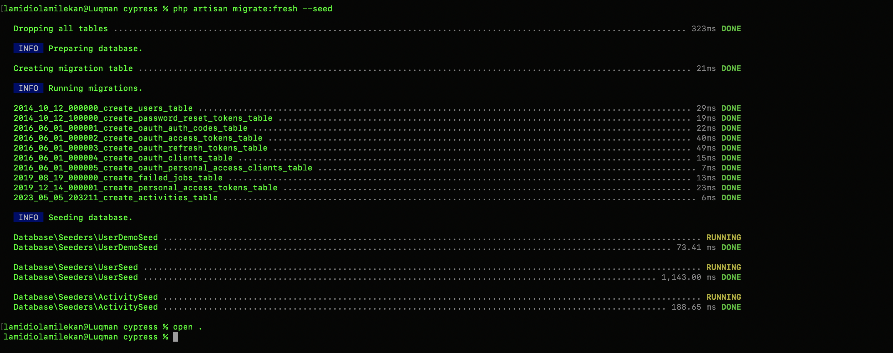
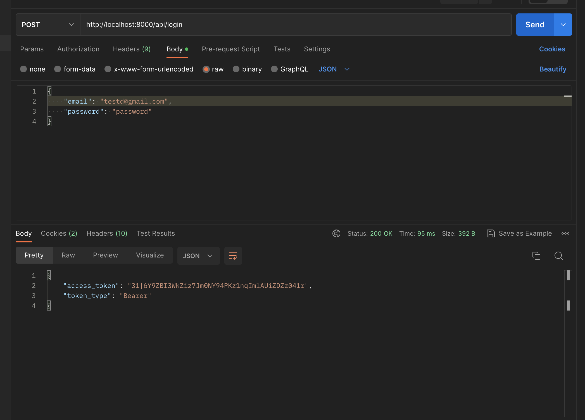
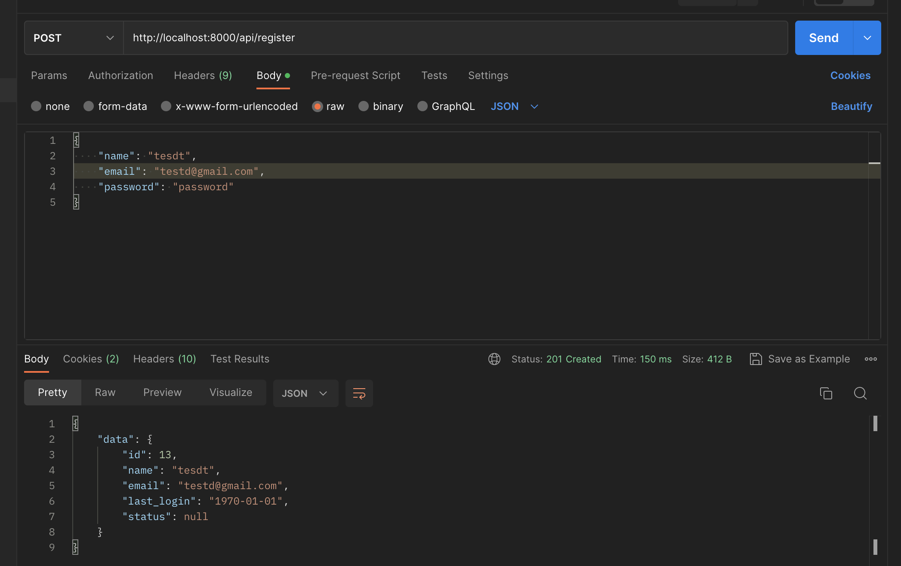
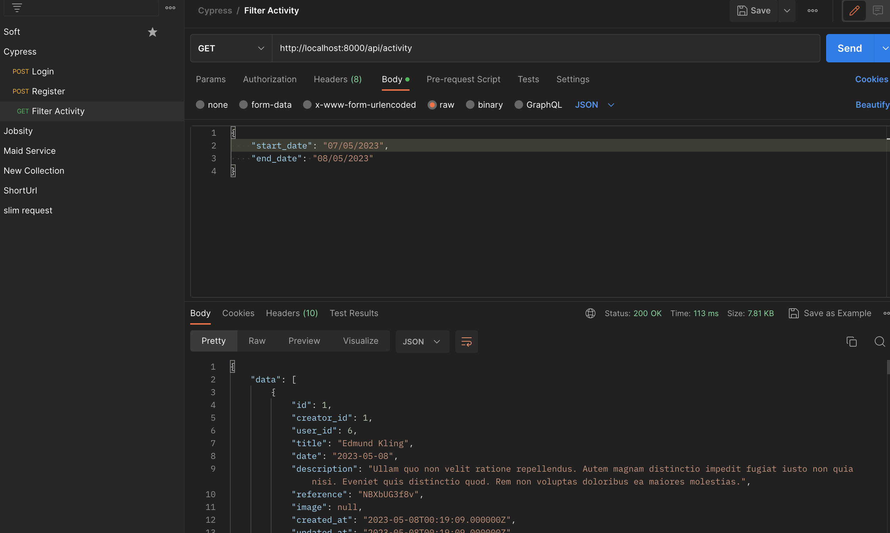
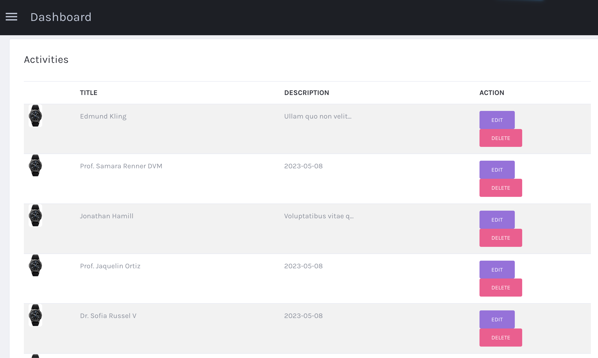
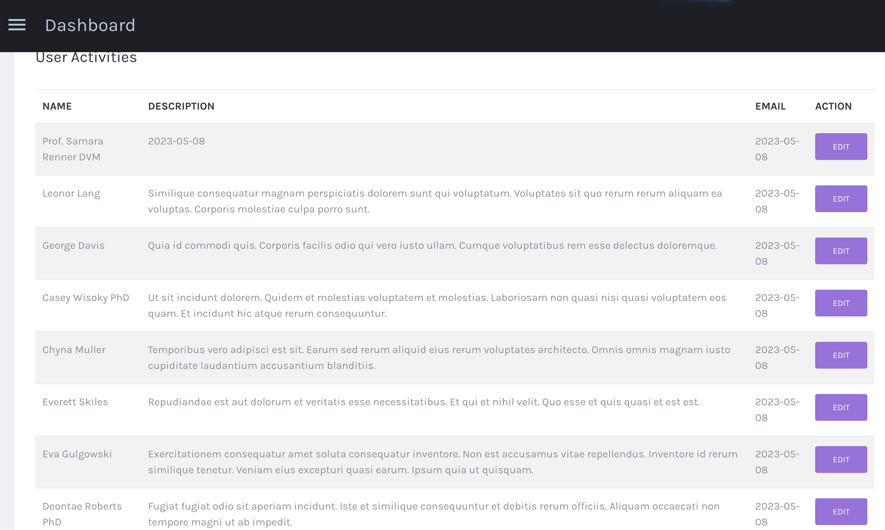

<p align="center">
<svg alt="Cypress home page" class="Brand__LogoSvg-sc-1fh3ez4-4 gioBgr has-shadow" width="100%" height="100%" viewBox="0 0 164 30"><defs><polygon points="0 0.113415324 24.9228528 0.113415324 24.9228528 29.4994181 0 29.4994181"></polygon></defs><g stroke="none" stroke-width="1" fill="none" fill-rule="evenodd"><g transform="translate(-209.000000, -22.000000)"><g transform="translate(209.000000, 22.000000)"><g><mask fill="white"><use href="#path-1"></use></mask><path d="M24.9228528,25.7445684 C23.4713552,26.9380925 21.9017897,27.8623173 20.2138674,28.5169588 C18.525656,29.1721684 16.7485686,29.4994181 14.8827496,29.4994181 C12.8092641,29.4994181 10.869165,29.1061219 9.06274127,28.3203817 C7.25588398,27.5344994 5.67865927,26.479602 4.33135617,25.1548371 C2.98347502,23.8303564 1.9249107,22.2732215 1.15494064,20.4827223 C0.384537038,18.6923652 -1.445139e-05,16.7933509 -1.445139e-05,14.7848273 C-1.445139e-05,12.7476126 0.384537038,10.8403603 1.15494064,9.06434872 C1.9249107,7.28933143 2.98347502,5.73929832 4.33135617,4.41439144 C5.67865927,3.09005271 7.25588398,2.04197296 9.06274127,1.27057831 C10.869165,0.499751807 12.8092641,0.113415324 14.8827496,0.113415324 C16.4819404,0.113415324 18.0591651,0.382856614 19.6139902,0.921313087 C21.1689597,1.46019567 22.6717598,2.23855005 24.1232574,3.25722846 L22.5684324,4.43612287 C21.44238,3.65024061 20.2284633,3.0539757 18.9255259,2.64604982 C17.6217215,2.23855005 16.274563,2.03472915 14.8827496,2.03472915 C13.0757478,2.03472915 11.3875364,2.36893862 9.81797092,3.03749958 C8.2479719,3.70606055 6.87812464,4.61423535 5.70871816,5.76188196 C4.53815556,6.90952858 3.62063681,8.26085405 2.95428322,9.81571636 C2.28792962,11.3707207 1.95453605,13.033814 1.95453605,14.8062747 C1.95453605,16.5504703 2.28792962,18.199076 2.95428322,19.7540804 C3.62063681,21.3090847 4.53815556,22.6605522 5.70871816,23.8079148 C6.87812464,24.9557034 8.2479719,25.8712641 9.81797092,26.5541706 C11.3875364,27.2372192 13.0757478,27.5783884 14.8827496,27.5783884 C16.4819404,27.5783884 18.021736,27.2799719 19.5030035,26.6831388 C20.9836929,26.0868739 22.3755063,25.2495748 23.6790217,24.1722357 L24.9228528,25.7445684 Z" fill="#525B6B" mask="url(#mask-2)"></path></g><polygon fill="#FFFFFF" points="45.6662781 0 47.4216867 0.839110306 29.490103 29.6385542 27.6626506 28.4327642"></polygon><path d="M53.3545068,2.90097126 L53.3545068,16.508625 L59.4333235,16.508625 C60.3634108,16.508625 61.2343241,16.3278873 62.0450381,15.9651391 C62.8554591,15.6035223 63.5680378,15.1175953 64.1837996,14.5089137 C64.7986826,13.9003735 65.287015,13.1829382 65.6471859,12.3571734 C66.0075032,11.5309843 66.1875154,10.6545903 66.1875154,9.72671859 C66.1875154,8.76999673 66.0075032,7.87875339 65.6471859,7.05270574 C65.287015,6.2267995 64.7986826,5.50936417 64.1837996,4.90068259 C63.5680378,4.29214243 62.8476962,3.80706394 62.0223352,3.44417432 C61.1963883,3.08241608 60.3182979,2.90097126 59.388357,2.90097126 L53.3545068,2.90097126 Z M51.373494,29.6385542 L51.373494,0.987951807 L59.3432442,0.987951807 C60.543423,0.987951807 61.6771043,1.22030865 62.7426768,1.68346668 C63.8081029,2.14761467 64.7463926,2.7705799 65.557253,3.55306949 C66.367674,4.33555908 67.0051134,5.25593541 67.4708895,6.31363279 C67.9356402,7.37203729 68.1686747,8.50921401 68.1686747,9.72671859 C68.1686747,10.9439403 67.9356402,12.0819656 67.4708895,13.1392387 C67.0051134,14.1980675 66.3821746,15.1175953 65.6022195,15.9000848 C64.8209461,16.6825744 63.8981822,17.2987514 62.8327562,17.7477672 C61.7671836,18.1974901 60.6335024,18.421503 59.4333235,18.421503 L53.3545068,18.421503 L53.3545068,29.6385542 L51.373494,29.6385542 Z" fill="#525B6B"></path><path d="M74.0882336,2.90097126 L74.0882336,16.5524659 L80.3926312,16.5524659 C81.3757071,16.5524659 82.2851868,16.3715868 83.1201977,16.00898 C83.954045,15.6466561 84.684625,15.1545065 85.3112104,14.5308341 C85.9364868,13.9078689 86.4280975,13.1829382 86.7857515,12.3571734 C87.1434055,11.5309843 87.3223053,10.6545903 87.3223053,9.72671859 C87.3223053,8.79941257 87.1434055,7.92245288 86.7857515,7.0962638 C86.4280975,6.27021615 85.9364868,5.54613397 85.3112104,4.92260305 C84.684625,4.29963781 83.954045,3.80706394 83.1201977,3.44417432 C82.2851868,3.08241608 81.3757071,2.90097126 80.3926312,2.90097126 L74.0882336,2.90097126 Z M74.0882336,18.4652025 L74.0882336,29.6385542 L72.1204819,29.6385542 L72.1204819,0.987951807 L80.3926312,0.987951807 C81.644493,0.987951807 82.8134501,1.2345923 83.9018296,1.72688333 C84.9903545,2.22016431 85.9364868,2.86505 86.741972,3.6615404 C87.5461481,4.45916217 88.1725881,5.37883139 88.6191102,6.42252797 C89.0667959,7.46580028 89.2906387,8.55263065 89.2906387,9.6830191 C89.2906387,11.480638 88.7825926,13.1253793 87.769991,14.6178088 C86.7560803,16.1108041 85.339718,17.1759968 83.5216313,17.8128215 C84.2382483,18.740976 84.9973359,19.7118401 85.8028211,20.725838 C86.6069972,21.7409673 87.4123369,22.7549652 88.2176766,23.7695288 C89.0217073,24.7839509 89.818902,25.7910191 90.6088243,26.7905919 C91.3987467,27.7907304 92.1521618,28.7402398 92.8674699,29.6385542 L90.3637462,29.6385542 L81.5106819,18.4652025 L74.0882336,18.4652025 Z" fill="#525B6B"></path><polygon fill="#525B6B" points="98.7594962 1.97590361 113.614458 1.97590361 113.614458 0 96.8192771 0 96.8192771 1.97590361"></polygon><polygon fill="#525B6B" points="98.780119 27.6219617 98.780119 12.8625918 108.763958 12.8625918 108.763958 10.8674699 96.8192771 10.8674699 96.8192771 29.6385542 114.60241 29.6385542 114.60241 27.6219617"></polygon><path d="M139.301205,21.4153255 C139.301205,22.7344637 139.013117,23.9074124 138.437517,24.9330273 C137.861341,25.9597866 137.086285,26.8240495 136.111628,27.5273896 C135.13697,28.2308727 133.991536,28.7586996 132.677918,29.1104412 C131.363579,29.462755 129.967526,29.6385542 128.491345,29.6385542 C127.87107,29.6385542 127.184068,29.5943541 126.431206,29.5063829 C125.677911,29.4184118 124.909772,29.301403 124.127078,29.1546414 C123.344239,29.0084519 122.561545,28.8250714 121.779427,28.6049289 C120.996012,28.3853587 120.250932,28.1582071 119.542169,27.9234743 L120.321404,26.2963656 L121.491339,26.560136 C121.846297,26.6481072 122.275763,26.7512409 122.77916,26.8682496 C123.282702,26.9852584 123.816075,27.1029824 124.378705,27.2199912 C124.941334,27.337 125.496469,27.4325524 126.044542,27.5059332 C126.593192,27.579314 127.089672,27.6155038 127.533838,27.6155038 L129.399709,27.6155038 C130.43576,27.6155038 131.427422,27.4691713 132.376283,27.1757911 C133.323846,26.8834121 134.160584,26.4652988 134.886353,25.9224525 C135.611545,25.3803213 136.189594,24.706448 136.619204,23.8998312 C137.048094,23.0936435 137.263403,22.1631519 137.263403,21.1072119 C137.263403,20.6388907 137.152578,20.1328063 136.93136,19.5901029 C136.709565,19.0484009 136.466009,18.6012499 136.200115,18.2487932 C135.757102,17.663034 135.262063,17.1935685 134.715719,16.8418269 C134.168943,16.4900853 133.600837,16.2193058 133.009961,16.028201 C132.419085,15.8383836 131.81423,15.7060692 131.193954,15.6328315 C130.573679,15.5600228 129.938271,15.4940802 129.28874,15.4347176 C128.254274,15.3764993 127.2286,15.2810899 126.209411,15.1487756 C125.190799,15.0171764 124.193948,14.6584258 123.219291,14.0713793 L123.26339,14.0713793 C122.228781,13.4854771 121.372875,12.6498227 120.693944,11.5654173 C120.013861,10.4810119 119.674611,9.26400609 119.674611,7.91525812 C119.674611,6.00993169 120.37588,4.3755278 121.779427,3.01218949 C123.181676,1.64899423 125.079829,0.733235983 127.472156,0.263770416 C127.796706,0.205552108 128.298806,0.147047716 128.978314,0.0879711529 C129.657821,0.0294667601 130.455215,0 131.371217,0 C131.842909,0 132.382047,0.0433418851 132.9882,0.129310443 C133.593343,0.215279 134.21333,0.329999105 134.848882,0.472612503 C135.483858,0.616513283 136.103845,0.774289188 136.709565,0.94608326 C137.31442,1.11787733 137.868403,1.30397566 138.371224,1.50466432 L137.617785,3.2981315 C136.908878,3.03436108 136.244214,2.82194293 135.623939,2.66030488 C135.003807,2.49966812 134.40587,2.36020166 133.829693,2.24276375 C133.254094,2.12575496 132.684979,2.04479289 132.123935,2.0007358 C131.562459,1.95682174 130.957027,1.93493624 130.307929,1.93493624 C129.332695,1.93493624 128.336421,2.05294632 127.317232,2.28796519 C126.298043,2.52384231 125.367917,2.88430947 124.526135,3.36936668 C123.684065,3.85542518 122.989858,4.4730828 122.443514,5.2231978 C121.896737,5.97359889 121.623926,6.87862894 121.623926,7.93800188 C121.623926,8.64434587 121.853358,9.42421372 122.31208,10.2774624 C122.77109,11.1309971 123.341357,11.7791228 124.022594,12.2199799 C124.880949,12.7499524 125.747087,13.0806667 126.620863,13.2135532 C127.49435,13.3462967 128.390464,13.4418491 129.308051,13.5000674 C130.343814,13.5588579 131.431602,13.6980383 132.572281,13.9176086 C133.712383,14.137751 134.786048,14.5704546 135.79241,15.2151473 C136.858581,15.8895928 137.709299,16.7981989 138.346003,17.9413948 C138.983141,19.0845906 139.301205,20.242949 139.301205,21.4153255" fill="#525B6B"></path><path d="M164,21.4153255 C164,22.7344637 163.711912,23.9074124 163.136312,24.9330273 C162.560136,25.9597866 161.78508,26.8240495 160.810423,27.5273896 C159.835766,28.2308727 158.690475,28.7586996 157.376713,29.1104412 C156.062374,29.462755 154.666466,29.6385542 153.190141,29.6385542 C152.569865,29.6385542 151.882863,29.5943541 151.130001,29.5063829 C150.376706,29.4184118 149.608712,29.301403 148.825873,29.1546414 C148.043034,29.0084519 147.260484,28.8250714 146.478222,28.6049289 C145.694807,28.3853587 144.949871,28.1582071 144.240964,27.9234743 L145.0202,26.2963656 L146.190134,26.560136 C146.545236,26.6481072 146.974558,26.7512409 147.477955,26.8682496 C147.981641,26.9852584 148.514871,27.1029824 149.077644,27.2199912 C149.640273,27.337 150.195408,27.4325524 150.743482,27.5059332 C151.291988,27.579314 151.788467,27.6155038 152.232633,27.6155038 L154.098504,27.6155038 C155.134699,27.6155038 156.126362,27.4691713 157.075078,27.1757911 C158.022641,26.8834121 158.859523,26.4652988 159.585292,25.9224525 C160.310484,25.3803213 160.88839,24.706448 161.318,23.8998312 C161.746889,23.0936435 161.962199,22.1631519 161.962199,21.1072119 C161.962199,20.6388907 161.851373,20.1328063 161.630155,19.5901029 C161.40836,19.0484009 161.164804,18.6012499 160.89891,18.2487932 C160.456041,17.663034 159.960858,17.1935685 159.414658,16.8418269 C158.867738,16.4900853 158.299632,16.2193058 157.7089,16.028201 C157.11788,15.8383836 156.513025,15.7060692 155.89275,15.6328315 C155.272474,15.5600228 154.637066,15.4940802 153.987535,15.4347176 C152.953214,15.3764993 151.927395,15.2810899 150.908206,15.1487756 C149.889738,15.0171764 148.892743,14.6584258 147.918086,14.0713793 L147.962185,14.0713793 C146.92772,13.4854771 146.071671,12.6498227 145.39274,11.5654173 C144.712656,10.4810119 144.373551,9.26400609 144.373551,7.91525812 C144.373551,6.00993169 145.07482,4.3755278 146.478222,3.01218949 C147.880616,1.64899423 149.778769,0.733235983 152.170952,0.263770416 C152.495501,0.205552108 152.997746,0.147047716 153.677253,0.0879711529 C154.356616,0.0294667601 155.15401,0 156.070012,0 C156.541704,0 157.080987,0.0433418851 157.687139,0.129310443 C158.292138,0.215279 158.91227,0.329999105 159.547678,0.472612503 C160.182653,0.616513283 160.802785,0.774289188 161.40836,0.94608326 C162.01336,1.11787733 162.567198,1.30397566 163.070019,1.50466432 L162.31658,3.2981315 C161.607817,3.03436108 160.94301,2.82194293 160.322734,2.66030488 C159.702747,2.49966812 159.104665,2.36020166 158.528489,2.24276375 C157.952889,2.12575496 157.383775,2.04479289 156.822731,2.0007358 C156.261398,1.95682174 155.655823,1.93493624 155.006868,1.93493624 C154.031634,1.93493624 153.03536,2.05294632 152.016171,2.28796519 C150.996838,2.52384231 150.066857,2.88430947 149.224931,3.36936668 C148.38286,3.85542518 147.688653,4.4730828 147.142453,5.2231978 C146.595532,5.97359889 146.322721,6.87862894 146.322721,7.93800188 C146.322721,8.64434587 146.552298,9.42421372 147.011019,10.2774624 C147.469885,11.1309971 148.040296,11.7791228 148.721389,12.2199799 C149.579744,12.7499524 150.445882,13.0806667 151.319658,13.2135532 C152.19329,13.3462967 153.089259,13.4418491 154.006991,13.5000674 C155.042609,13.5588579 156.130541,13.6980383 157.27122,13.9176086 C158.411178,14.137751 159.484987,14.5704546 160.491206,15.2151473 C161.557376,15.8895928 162.408238,16.7981989 163.044799,17.9413948 C163.68208,19.0845906 164,20.242949 164,21.4153255" fill="#525B6B"></path><polygon fill="#525B6B" points="29.8198871 0.987951807 27.6626506 0.987951807 32.4630403 8.89156627 33.5903614 7.20938577"></polygon></g></g></g></svg>
</p>

## Challenge

## Laravel Practical Task Requirements 
- Create an admin panel using any template you prefer with a super admin login feature. 
- In the admin panel the super admin should be able to see the dates of the calendar and create an activity for each day. The admin may add a maximum of 4 activities for each day. 
- Each activity should have the following fields 
- Title 
- Description 
- Image 
- Each activity may be edited and deleted from the admin panel - When an activity is added/edited/deleted, it should reflect for each of the users. For example, when the admin creates an activity, the given activity should be added for all the users. The same for editing and deleting. - The admin should see all the registered users with their activities. - The admin should be able to edit the activity that is added for the user. For example, if an activity is added for the user globally, the admin should be able to edit that particular activity and the changes should not reflect in the global activity. 
- Once an activity is edited for a particular user, the global changes should not affect it. 
- The admin can also add an activity for the given user, without adding a global activity. 
- Please provide the Postman collection, where we have the following Rest
APIs: 
- user registration 
- user login 
- get logged in user’s activities by a range of dates, for example, the range of dates may look like this “1/3/22 - 5/3/22”


## Technologies

- PHP ^8.1
- Laravel ^10.8
- Mysql


## How to run the application

Below are the steps you need to successfully set up and run the application.
- Clone the app from the repository and cd into the root directory of the app

    ```
    composer install
    ```

    ```
    cp .env.example .env
    ```

 Now, the most important, build and start the package dependencies by running
    `composer install`


Composer will start doing its magic. All required dependencies, will be installed.

- Update database credentials to match in your env file

While composer is doing its magic, you need to add to modify `.env` file:
```
 DB_CONNECTION=mysql
 DB_HOST=127.0.0.1
 DB_PORT=3306
 DB_DATABASE=laravel
 DB_USERNAME=root
 DB_PASSWORD=
```

### To Migrate the database in the project, command below
```
 php artisan migrate --seed
```




They are some pre-seed data in the seeder file.

* Run  `php artisan serve`

## Sample Requests (Api Request)
The Cypress API gives you access to pretty much all the features you can use on  user’s logged activities.
The Api Collection is located in the application, and it called `Cypress.postman_collection.json`

###

## Here is some login and register postman 

# Login


```json

{
    "email": "testd@gmail.com",
    "password": "password"
}

```

# Register


```json

{
    "name": "tesdt",
    "email": "testd@gmail.com",
    "password": "password"
}

```

# Filter Activities


```json

{
    "start_date": "01/05/2023",
    "end_date": "08/05/2023"
}
```


# Pages





